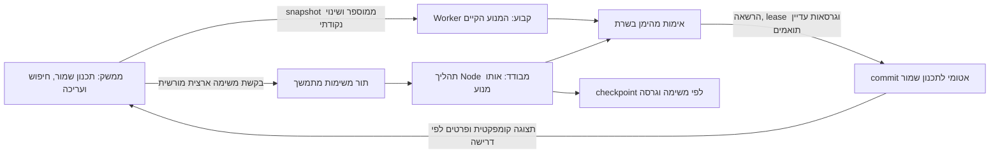

# תוכנית PR #3 — הפרדת החישוב מהממשק

טיוטת אפיון לאישור. אין כאן שינוי קוד מוצר, שכתוב אלגוריתם, שירות פרוס או migration. פיתוח יתחיל רק לאחר אישור התוכנית. בסיס הקוד הנבדק: `206b45fe57c0d529720c1f2ef400b65997aa98ea`, PR #2222; את ענף הפיתוח יש לפתוח מהבסיס המאושר לאחר החלטת המיזוג.

## ההחלטה

ארכיטקטורה משולבת: **Web Worker קבוע לחישוב נקודתי**, ו־**שירות Node עצמאי עם תור משימות ו־checkpoint מתמשך לחישוב ארצי**. הממשק קורא את התכנון השמור, משתמש באותו מנוע קיים ובאותם אילוצים, ומקבל התקדמות קומפקטית בלבד. שירות מהימן מאמת תוצאות והרשאות לפני commit אטומי. חישוב ארצי לא חוזר ל־Main Thread כש־Worker או שרת נכשלים.

Worker מפחית הפרעה לממשק, אבל אינו ממשיך לפעול לאחר סגירת המסך ואינו פתרון לקריסת הדפדפן. השירות העצמאי נדרש כדי להפריד את חיי המשימה מחיי הדפדפן ולבודד את הזיכרון הכבד ממכשיר המשתמש. יכולת התאוששות של השירות תיבנה ותוכח; היא לא הוכחה בבדיקת היתכנות של runtime בלבד.

## ראיות שנמדדו לצורך ההחלטה

כל הבדיקות השתמשו באותו JSON סינתטי של 253 פעילויות ו־49 מדריכים מהסביבה המבודדת של PR #2222, 8,867,991 bytes. Chromium 151.0.7922.173 ו־Node 24.19.0 על אותה מכונת Linux. בריצות ההיתכנות אין מסד נתונים, הרשאות ייצור או כתיבות; מסלולים טעונים מראש ורשת חיצונית חסומה. זו בדיקת המנוע עם ממשק מדידה קטן, לא מבחן של כל מסך המוצר או מובייל פיזי.

| מקרה | דגימות | זמן קיר | הפרעה לממשק שנמדדה |
|---|---:|---:|---|
| נקודתי בסיס ב־Main Thread | 3 | חציון 666ms | פיגור callback ב־p95: ‏13–19.2ms לפי דגימה |
| נקודתי בסיס, Worker חדש בכל פעם | 3 | חציון 995ms | ‏6.2–8.2ms; העתקת snapshot חסמה סינכרונית 23–34.8ms |
| Worker קבוע, חישוב ראשון | 1 | 1,077ms | אתחול והעתקה ראשונית כלולים |
| אותו Worker ואותו snapshot, חישובים חוזרים | 2 | 647ms, ‏664ms | ‏4.2–6ms; הודעת הפעלה סינכרונית 0–0.1ms |
| ארצי בסיס ב־Main Thread | 1 | 71.37s | p95 ‏18.9ms; פיגור callback מרבי 61.1ms |
| ארצי בסיס ב־Worker | 1 | 71.61s | p95 ‏4.3ms; מרבי 35ms |
| ארצי בסיס ב־Node עצמאי | 1 | 44.20s | CPU ‏49.39s; RSS מרבי שנדגם כ־1.09GiB |

כל התוצאות מכסות 253/253 פעילויות, תקינות וללא כשלי אימות או אזהרות נסיעה. זמן ביטול Worker שנמדד לאחר הודעת ביטול: **3.9ms**, במקרה יחיד. לפני סגירת מסך נמצא Worker פעיל אחד; אחרי הסגירה נמצאו אפס. לא נשמרה תוצאה חלקית, משום שבבדיקת ההיתכנות אין מסלול כתיבה.

פערי Node/Chromium כוללים תזמון, GC והשהיות checkpoint של runtimes שונים. 44.20s אינו זמן שירות HTTP/תור/שמירה. לא יושם או נמדד שרת משימות, שחזור אחרי קריסת תהליך או עומס משתמשים. אין אחוזוני זמן ריצה על סמך דגימה ארצית אחת; p95 בטבלה מתייחס לאירועי callback בתוך אותה ריצה. frame gaps, מספר אירועים, זיכרון ותוצאות מפורטים ב־[MEASUREMENTS.json](MEASUREMENTS.json). `performance.memory` בדפדפן הוא נתון אבחוני לא מובטח ואינו מדידת RSS מבודדת של Worker.

המדידה שוללת יצירת Worker חדש והעתקת כל התוכנית בכל פעולה כפתרון לחישוב נקודתי מהיר. Worker קבוע צריך snapshot ממוספר והחלפת נתונים מושפעים בלבד. הריצה הארצית ב־Worker אינה מהירה יותר בדגימה הזו, ונפסקת עם המסך; לכן אינה הארכיטקטורה הסופית לריצה ארצית.

## מבנה ומסלול עבודה

1. **חוזה מנוע וסביבת ריצה:** להפריד מעטפת DOM/Supabase/נסיעות מן החישוב באמצעות adapters, בלי להחליף את האלגוריתם. לבנות אותו מודול בדפדפן וב־Node ולהוכיח parity של תוצאות, אילוצים ונתונים מוגנים. אין פונקציות DOM, לקוח Supabase או סודות בתוך payload.
2. **ממשק ו־Worker:** הממשק זמין מיד עם התכנון השמור. הכנת Worker מתבצעת ברקע; הפעלת חישוב נעשית רק בעקבות שינוי המחייב אותו או פקודה מפורשת. snapshot מסומן ב־engine token, ‏source revision, ‏workspace revision וטביעות הקשר. שינוי שולח delta מוגבל; החלפת snapshot נדרשת כאשר ההקשר השתנה. אין חישוב ארצי בעקבות פתיחה, חיפוש או ניווט. נדרשת דרך לטעינת snapshot בלי להעתיק 8.9MB על ה־Main Thread במכשיר חלש; לבחון טעינה בתוך Worker מול העברה במקטעים/ב־ArrayBuffer. לבחור לאחר מדידת clone, parse וזיכרון בפועל.
3. **שירות משימות ארציות:** endpoint בודק משתמש פעיל והרשאות קיימות ומחזיר run ID; תור מתמשך מפעיל תהליך Node נפרד. הממשק יכול להתנתק ולחזור לפי run ID. לשמור engine build, מקור, טביעות, שלב, scope, completion IDs ו־checkpoint לכל משימה. תקציב ראשוני לבדיקה: לפחות 2GiB למחשב משימה ובתחילה חישוב כבד אחד לכל worker; אלה הנחות לתכנון משאבים שיש לאמת בעומס, לא מדידות קיבולת. לבחור hosting/אזור לפי משאבים, זמני SQL ועלויות; לא להניח ש־Edge Function מתאים לריצה של כ־44s וכ־1.09GiB.
4. **התקדמות וביטול:** הודעות קטנות עם run ID, ‏revision, שלב ומונה; רינדור התקדמות מרוסן לכ־4 פעמים בשנייה. אין להעביר או לרנדר את כל rows/options בכל הודעה. ביטול משתף AbortSignal במנוע; בעלות ו־fencing עוצרים commit אחרי ביטול. על השרת נדרש watchdog לתהליך שאינו מגיב. ניווט אינו ביטול משימה ארצית; יציאה מן החשבון מבטלת גישה לתוצאות ולקלט, והמשך המשימה כפוף למדיניות המורשית שתוגדר.
5. **שמירה והתאוששות:** כל תוצאה היא הצעה עד אימות שרת על snapshot מהימן ומסלולים ידועים. commit בודק הרשאה עדכנית, source/workspace revision ובעלות באותה עסקה. משתמש לא יכול להעביר `validated=true` ולעקוף אימות. שינוי מקור בזמן ריצה מסמן את התוצאה כמיושנת; לא מציגים אותה כמעודכנת. לבצע rebase לפי הסגירה הטרנזיטיבית, כולל מעבר דרך נעילות ואישורים, בלי להזיזם. בסיס תקין והמשך אופטימיזציה נשמרים בשלבים נפרדים; כשל שיפור אינו מחליף בסיס תקין. checkpoint מסוג rows, פגום, ממנוע אחר או עם מקור ישן אינו כשיר ל־commit.
6. **הפעלה מבוקרת:** adapters ו־Worker נקודתי, אחריהם שירות מתמשך ואימות שמירה, ולאחריהם מבחני קבלה ועומס באותה סביבה מבודדת. כל שינוי schema יגיע ב־migration לבדיקה בלבד. אין שינוי הרשאות עסקיות, deploy, merge או migration בייצור ללא אישור נפרד. כאשר שירות אינו זמין, נשארים תכנון שמור, עריכה וחיווי אמיתי; אין fallback ארצי סינכרוני.

## סיכונים

- זיכרון ותחרות CPU בין משימות: process isolation, הגבלת מקביליות, תור, מגבלת זיכרון וניטור. OOM צריך לסיים משימה ולשמר את התכנון המחויב.
- העתקה, פירוק JSON ו־progress עדיין עלולים לחסום את הממשק גם כשהמנוע ב־Worker: למדוד אותם בנפרד ולהעביר רק נתונים נדרשים.
- snapshot ישן או delta חסר: revision מלא, ביטול snapshot ושחזור, סגירת תלויות הכוללת עוגנים ומבחני שינוי במהלך ריצה.
- drift בין מנועי Worker/Node, דפדפן ו־timezone: build זהה, תאריכי ISO וחבילת regression משותפת.
- הרשאות וסודות: RLS ו־capabilities קיימים, בדיקות אדמין/מנהל/ללא הרשאה, JWT מאומת בשרת; service role נשאר בשרת. גישה ל־run/result אינה נגזרת מידיעת run ID בלבד.
- הפעלה כפולה או חידוש לאחר כשל: idempotency, ‏lease/fencing, CAS ו־commit אחד בלבד לכל גרסה. durable queue אינה מבטיחה זאת בלי מבחני תקלה.

## מבחני קבלה ויעדים מוצעים

היעדים הבאים מיועדים לפיתוח לאחר אישור, ולא מתוארים כיכולות שכבר הוכחו. יש לקבע אותם מול גרסת הבסיס, אותו fixture ואותה חומרה, לאחר מדידות בממשק האמיתי ובמובייל/CPU מואט.

| תחום | מבחן ויעד |
|---|---|
| תגובה בזמן ריצה ארצית | פתיחה, חיפוש, ניווט, עריכה ושמירת עריכה: p95 מזמן קלט עד paint ≤100ms, מרבי ≤250ms; אין long task מעל 50ms שמקורו בהעתקת snapshot או טיפול בהתקדמות. לפחות 20 הפעלות בכל מצב בדפדפן רגיל וב־CPU ×4, ומכשיר מובייל מייצג לפני אישור שחרור. |
| חישוב נקודתי | Worker מחומם על אותו בסיס 253: יעד p95 ≤800ms ליצירת בסיס תקין; הצגת מצב התחלה ≤100ms. להריץ לפחות 20 מדידות חמות ו־20 קרות; למדוד bootstrap/clone/parse/חישוב/אימות/שמירה בנפרד. cold start אינו מעכב תפעול הממשק. |
| ריצה ארצית | יעד compute בלבד ≤60s על אותה מכונת בדיקה, מול 44.20s שנמדדו ב־Node בדגימה יחידה. למדוד בנפרד זמן תור, טעינת SQL, מסלולים, אימות ושמירה; SLA שירות כולל ייקבע לאחר ניסוי השירות ולא מה־CLI. ריצה לעולם לא נעשית ב־Main Thread. |
| ביטול | חיווי UI ≤100ms; אישור ביטול Worker/שרת ≤1s בסביבה המבודדת, כולל checkpoint עמוס ו־GC. אין commit לאחר ביטול או אובדן בעלות. |
| התקדמות | payload קטן, מונים וגרסאות בלבד; רינדור ≤4Hz, ללא rows/options. עקביות והשלמה נשמרות גם בחיבור מחדש. |
| שימור אילוצים | parity של כיסוי, שעות, מרחקים ואילוצים קשיחים מול המנוע הממוזג; אפס חפיפות/מעברים לא חוקיים. שיבוצים מאושרים, טיוטות, תאריכים, נעילות ואישורי חריגות אינם משתנים שלא בעקבות הפעולה המורשית. |
| מקור ושמירה | עריכה ושינוי זמינות בזמן חישוב, שני משתמשים, תוצאה מאוחרת וגרסה ישנה: CAS דוחה שמירה מיושנת, אין דריסה או תווית “מעודכן” שגויה. |
| שחזור | סגירת tab, סגירת דפדפן, רענון, אובדן רשת, קריסת Worker, הריגת תהליך Node, restart/OOM, checkpoint פגום וכשל אופטימיזציה — כל אחד בנפרד. שירות ארצי ממשיך אחרי סגירת דפדפן; לאחר כשל שרת הוא משחזר checkpoint תואם בלבד; התכנון התקין האחרון נשאר. |
| הרשאות | אדמין, מנהל מורשה, משתמש ללא הרשאה, הרשאה שנשללה באמצע, run ID של משתמש אחר, result מזויף ו־checkpoint מזויף. אין רשות לקרוא/לשמור בעקבות role או validated שהלקוח סיפק. |

לפיתוח נדרש אישור לתוכנית. החלטת מיזוג PR #2222 נפרדת, וגם פריסה/שינוי מסד בייצור מחייבים אישור נפרד.

## שחזור בדיקות ההיתכנות

קובצי `probes/` הם סקריפטי מדידה מבודדים, לא קוד מוצר. להעתיקם לתיקיית עבודה שמכילה `repo/` עם הקוד ב־commit המצוין ו־node_modules מותקן, ו־`isolated-fixture.json` מפוענח מה־fixture הסינתטי שב־[PR #2222](https://github.com/Taasiyeda2026/dashboard_system/blob/206b45fe57c0d529720c1f2ef400b65997aa98ea/docs/scheduling-point-engine-20261009/README.md). צריך Chromium ב־`/usr/bin/chromium`; שרת Vite קשור ל־127.0.0.1:5179 בלבד. להריץ browser, ‏resident ו־Node ברצף ללא build או חישוב אחר במקביל. Node דורש `--expose-gc`. אין לחבר את הסקריפטים למסד קיים או לאפשר רשת חיצונית. קובץ המדידות מכיל את התוצאות בפועל.
